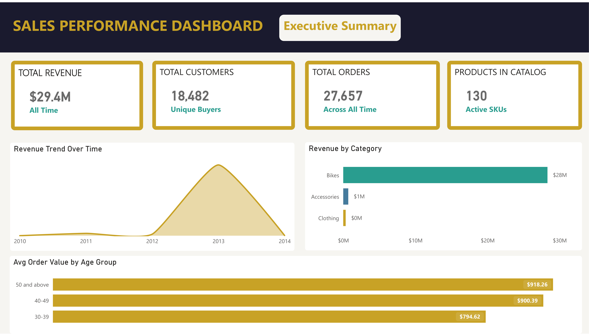
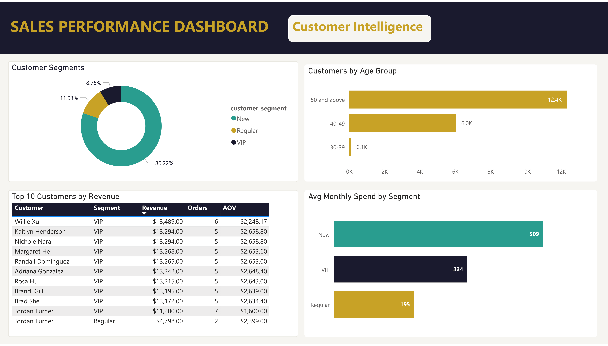
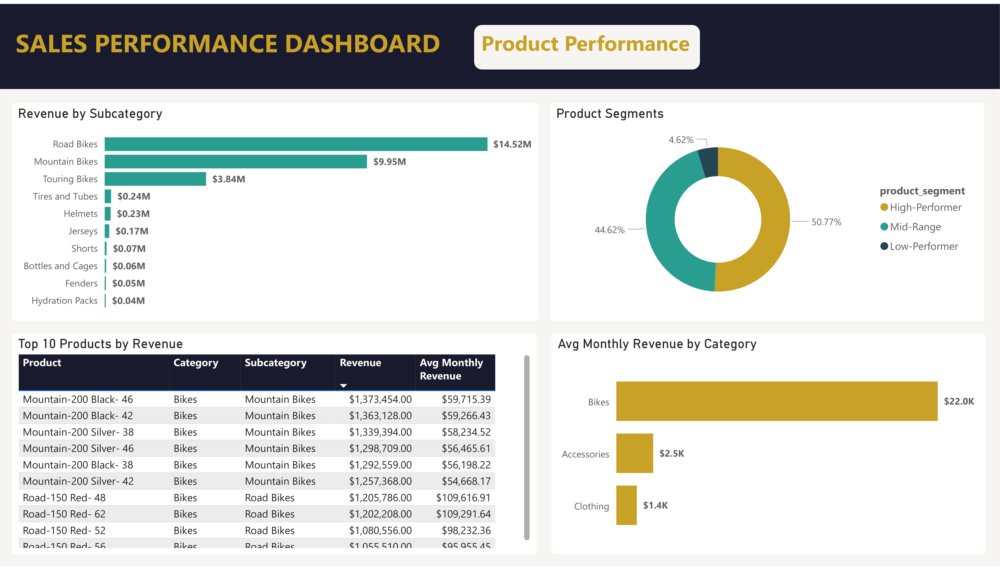

# SQL Data Analytics Project

> A data analytics project built on top of a real data warehouse, using pure SQL to explore data,
> find patterns, and answer business questions about customers, products, sales,
> and visualize insights through an interactive Power BI dashboard.

---

## 📑 Table of Contents

- [End-to-End Project Series](#-end-to-end-project-series)
- [Executive Summary](#-executive-summary)
- [Business Problem](#-business-problem)
- [Analytics Roadmap](#️-analytics-roadmap)
- [Tech Stack](#️-tech-stack)
- [Project Structure](#-project-structure)
- [Exploratory Data Analysis (EDA)](#-exploratory-data-analysis-eda)
- [Advanced Data Analytics (ADA)](#-advanced-data-analytics-ada)
- [Business Reports](#-business-reports)
- [Power BI Dashboard](#-power-bi-dashboard)
- [Results & Recommendations](#-results--recommendations)
- [Key Insights](#-key-insights)

---

## 🔗 End-to-End Project Series

This project is part of a three-part data pipeline I built from scratch:

| # | Project | What It Does | Repo |
|---|---------|-------------|------|
| 1 | **Data Warehouse** | Built the data infrastructure — ETL pipelines, Bronze/Silver/Gold layers, Star Schema | https://github.com/Mohd-Shabir/data-warehouse-sql-project- |
| 2 | **Data Analytics** | Analysed the Gold layer data using EDA and Advanced SQL *(this repo)* | — |
| 3 | **Power BI Dashboard** | Built an interactive sales dashboard on top of the analytics *(this repo)* | — |

---

## 📖 Executive Summary

This project is the second and third part of a three-part end-to-end data pipeline. Starting from the Gold layer produced by the Data Warehouse project, I first conducted **Exploratory Data Analysis (EDA)** across 6 scripts to understand the data — exploring dimensions, date ranges, KPIs, and rankings. I then applied **Advanced Data Analytics (ADA)** across 7 scripts to answer deeper business questions — analysing trends over time, cumulative growth, year-over-year performance, and customer/product segmentation. The final output was two reusable SQL views (`report_customers` and `report_products`) which I then connected directly to **Power BI** to build an interactive 3-page executive dashboard — segmenting the customer base, tracking high-value VIPs, and identifying top-performing product categories to help leadership optimize marketing spend and inventory.

---

## 🎯 Business Problem

The executive team lacked clear visibility into customer purchasing behaviors and product profitability. They needed to know:

| # | Business Question |
|---|------------------|
| 1 | Who are our most valuable customers (VIPs), and how do their purchasing habits differ from one-time buyers? |
| 2 | Do older demographics spend more than younger ones? |
| 3 | Which specific product categories are driving the actual revenue vs. just taking up warehouse space? |

---

## 🗺️ Analytics Roadmap


---
## 🛠️ Tech Stack

| Tool | Purpose |
|------|---------|
| MySQL | Database engine |
| DBeaver | SQL client |
| Git / GitHub | Version control |
| Power BI | Dashboard |

---

```
sql-data-analytics/
│
├── data/
│   ├── gold_layer/                       Used for Analytics
│   │   ├── gold_dim_customers.csv
│   │   ├── gold_dim_products.csv
│   │   └── gold_fact_sales.csv
│   └── report_layer/                     Used for Power BI Dashboard
│       ├── gold.report_customers.csv     
│       └── gold.report_products.csv      
│
├── docs/
│   └── analytics_roadmap.png
│
├── powerbi_dashboard/
│   ├── powerbi_dashboard.pbix
│   ├── powerbi_dashboard.pdf
│   ├── powerbi_dashboard1.png
│   ├── powerbi_dashboard2.png
│   └── powerbi_dashboard3.png
│
├── scripts/
│   ├── 01_eda_database_exploration.sql
│   ├── 02_eda_dimensions_exploration.sql
│   ├── 03_eda_date_range_exploration.sql
│   ├── 04_eda_measures_exploration.sql
│   ├── 05_eda_magnitude_analysis.sql
│   ├── 06_eda_ranking_analysis.sql
│   ├── 07_ada_change_over_time_analysis.sql
│   ├── 08_ada_cumulative_analysis.sql
│   ├── 09_ada_performance_analysis.sql
│   ├── 10_ada_part_to_whole_analysis.sql
│   ├── 11_ada_data_segmentation.sql
│   ├── 12_report_customers.sql
│   └── 13_report_products.sql
│
├── LICENSE
│
└── README.md
```
---

## 🔍 Exploratory Data Analysis (EDA)

| # | Script | What It Explores |
|---|--------|-----------------|
| 1 | Database Exploration | Tables, columns, data types using `INFORMATION_SCHEMA` |
| 2 | Dimensions Exploration | Unique countries, genders, and full product hierarchy |
| 3 | Date Range Exploration | Order date boundaries, customer age range, shipping speed |
| 4 | Measures Exploration | Core KPIs — total sales, orders, customers, average price |
| 5 | Magnitude Analysis | Revenue and quantity grouped by category, country, gender |
| 6 | Ranking Analysis | Top/bottom products and customers using `RANK()` and `PARTITION BY` |

---

## 📊 Advanced Data Analytics (ADA)

| # | Script | What It Answers |
|---|--------|----------------|
| 7 | Change-Over-Time | Monthly and quarterly sales trends, seasonality |
| 8 | Cumulative Analysis | Running total sales and 3-month moving average |
| 9 | Performance Analysis | Year-over-Year and Month-over-Month growth using `LAG()` |
| 10 | Part-to-Whole | Revenue contribution % by category and country |
| 11 | Data Segmentation | Customer loyalty, churn risk, and product cost segments |
| 12 | Report: Customers | Final customer view — age group, VIP/Regular/New, AOV |
| 13 | Report: Products | Final product view — performance segment, AOR, lifespan |

---

## 📊 Advanced Data Analytics (ADA)

| # | Script | What It Answers |
|---|--------|----------------|
| 7 | Change-Over-Time | Monthly and quarterly sales trends, seasonality |
| 8 | Cumulative Analysis | Running total sales and 3-month moving average |
| 9 | Performance Analysis | Year-over-Year and Month-over-Month growth using `LAG()` |
| 10 | Part-to-Whole | Revenue contribution % by category and country |
| 11 | Data Segmentation | Customer loyalty, churn risk, and product cost segments |
| 12 | Report: Customers | Final customer view — age group, VIP/Regular/New, AOV |
| 13 | Report: Products | Final product view — performance segment, AOR, lifespan |

---

## 📋 Business Reports

Two reusable `VIEW` objects created in the Gold layer, ready to connect to any BI tool:

- **`gold.report_customers`** — Customer segments, churn risk, recency, average order value
- **`gold.report_products`** — Product segments, cost range, average monthly revenue, lifespan

---

## 📊 Power BI Dashboard

Built an interactive 3-page sales dashboard on top of the Gold layer reporting views.

### 🔗 Pages

| Page | What It Shows |
|------|--------------|
| Executive Summary | KPI cards, revenue trend, category breakdown, AOV by age group |
| Customer Intelligence | Customer segments, age distribution, top 10 customers, avg monthly spend |
| Product Performance | Product segments, revenue by subcategory, top 10 products, avg monthly revenue |

---

### 🎨 Design

| Element | Value |
|---------|-------|
| Background | `#F7F6F2` warm white |
| Primary accent | `#C9A227` gold |
| Secondary | `#2A9D8F` teal |
| Header | `#1A1A2E` dark navy |

---

### 📁 Files

| File | Description |
|------|-------------|
| `powerbi_dashboard.pbix` | Power BI source file |
| `powerbi_dashboard.pdf` | Exported PDF of all 3 pages |
| `powerbi_dashboard1.png` | Executive Summary screenshot |
| `powerbi_dashboard2.png` | Customer Intelligence screenshot |
| `powerbi_dashboard3.png` | Product Performance screenshot |

### 🛠️ Tools

| Tool | Purpose |
|------|---------|
| Power BI | Dashboard building |
| DAX | KPI measures |
| CSV | Data source from Gold layer views |

### 📐 DAX Measures
```dax
Total Sales     = SUM(report_customers[total_sales])
Total Customers = DISTINCTCOUNT(report_customers[customer_key])
Total Orders    = SUM(report_customers[total_orders])
Total Products  = DISTINCTCOUNT(report_products[product_key])
```

---
## 📸 Screenshots

| Executive Summary | Customer Intelligence | Product Performance |
|---|---|---|
|  |  |  |

---

## 📈 Results & Recommendations

| # | Business Question | Finding | Recommendation |
|---|------------------|---------|---------------|
| 1 | Who are our most valuable customers (VIPs), and how do their purchasing habits differ from one-time buyers? | **80% of customers** are "New" (single purchases), while the tiny VIP segment **(8.75%)** drives massive value with an Average Order Value (AOV) of **$2,600+** per order. | Retain existing VIP customers through exclusive perks and early access offers, while implementing a loyalty program and personalized follow-up campaigns targeting New customers post-purchase — with tiered incentives designed to gradually move them toward Regular and VIP status. |
| 2 | Do older demographics spend more than younger ones? | The **50+ age group** dominates the customer base (12,400 customers) and maintains the highest AOV of **$918** (vs. $794 for the 30-39 group). | Tailor primary ad copy and imagery to resonate with the dominant 50+ demographic, while creating a secondary campaign targeting the 30-39 age group to diversify the customer base and reduce age-concentration risk. |
| 3 | Which product categories drive revenue vs. take up warehouse space? | **Road Bikes** alone generate **$14.5M** while apparel/clothing items (like Jerseys and Shorts) generate less than **$0.3M** combined despite taking up catalog space. | Reallocate marketing budget toward Road Bike accessories and cross-sell campaigns. For low-performing clothing SKUs, reduce inventory levels and run promotional pricing to clear stock before evaluating discontinuation on a case-by-case basis. |

---

## 💡 Key Insights

- 💰 **Total Revenue: $29.4M** across all time
- 🚴 **Bikes drive ~97% of revenue** — Road Bikes alone account for $14.52M
- 👥 **80% of customers are New segment** — significant upsell opportunity for Regular/VIP conversion
- 🏆 **Top customer: Willie Xu** — $13,489 in revenue across 6 orders
- 👴 **50+ age group dominates** — 12,400 customers, the largest demographic
- 📦 **130 active SKUs** — with 50.77% classified as High-Performers

---
