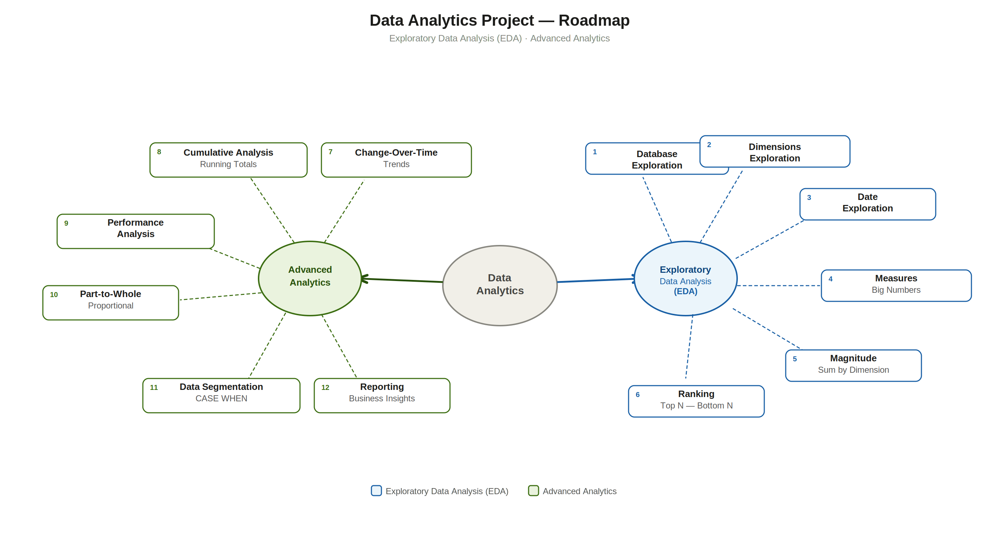

# SQL Data Analytics Project

> A data analytics project built on top of a real data warehouse, using pure SQL to explore data,
> find patterns, and answer business questions about customers, products, and sales.

---

## 🔗 End-to-End Project Series

This project is part of a three-part data pipeline I built from scratch:

| # | Project | What It Does | Repo |
|---|---------|-------------|------|
| 1 | **Data Warehouse** | Built the data infrastructure — ETL pipelines, Bronze/Silver/Gold layers, Star Schema | [data-warehouse-mysql](https://github.com/Mohd-Shabir/data-warehouse-mysql) |
| 2 | **Data Analytics** | Analysed the Gold layer data using EDA and Advanced SQL *(this repo)* | — |
| 3 | **Power BI Dashboard** | Built an interactive sales dashboard on top of the analytics *(coming soon)* | — |

## 📖 Overview

Using the Gold layer produced by the Data Warehouse project, this project explores the data
through Exploratory Data Analysis (EDA) and then applies advanced SQL techniques to answer
real business questions. The final output is two reusable reporting views ready for dashboards.

## 🗺️ Analytics Roadmap



## 🛠️ Tech Stack

| Tool | Purpose |
|------|---------|
| MySQL | Database engine |
| DBeaver | SQL client |
| Git / GitHub | Version control |
| Power BI | Dashboard *(coming soon)* |


```
sql-data-analytics/
│
├── scripts/
│   ├── 01_EDA_database_exploration.sql
│   ├── 02_EDA_dimensions_exploration.sql
│   ├── 03_EDA_date_range_exploration.sql
│   ├── 04_EDA_measures_exploration.sql
│   ├── 05_EDA_magnitude_analysis.sql
│   ├── 06_EDA_ranking_analysis.sql
│   ├── 07_ADA_change_over_time_analysis.sql
│   ├── 08_ADA_cumulative_analysis.sql
│   ├── 09_ADA_performance_analysis.sql
│   ├── 10_ADA_part_to_whole_analysis.sql
│   ├── 11_ADA_data_segmentation.sql
│   ├── 12_report_customers.sql
│   └── 13_report_products.sql
│
├── docs/
│   └── analytics_roadmap.png
│
└── README.md
```

## 🔍 Exploratory Data Analysis (EDA)

| # | Script | What It Explores |
|---|--------|-----------------|
| 1 | Database Exploration | Tables, columns, data types using `INFORMATION_SCHEMA` |
| 2 | Dimensions Exploration | Unique countries, genders, and full product hierarchy |
| 3 | Date Range Exploration | Order date boundaries, customer age range, shipping speed |
| 4 | Measures Exploration | Core KPIs — total sales, orders, customers, average price |
| 5 | Magnitude Analysis | Revenue and quantity grouped by category, country, gender |
| 6 | Ranking Analysis | Top/bottom products and customers using `RANK()` and `PARTITION BY` |


